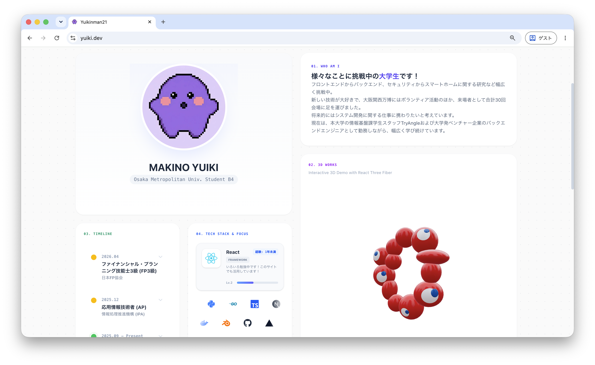

# MAKINO YUIKI — Portfolio

大阪公立大学 工学部 情報工学科 (B4) の **MAKINO YUIKI (Yuikinman21)** の個人ポートフォリオサイトです。
ネットワーク・IoTセキュリティの研究と、Web / スマートホーム基盤の開発内容をまとめています。

**Site: [https://yuiki.dev](https://yuiki.dev)**



## 概要

Next.js (App Router) の単一ページ構成で、Bento Grid 上に9枚のカードを配置しています。
プロジェクト詳細はモーダルで展開し、ページ遷移を伴わずに情報量を確保する構成です。

| # | カード | 内容 |
|---|---|---|
| — | Profile | プロフィールアイコンと所属 |
| 01 | WHO AM I | 自己紹介 |
| 02 | 3D WORKS | React Three Fiber による視線追従3Dモデル |
| 03 | TIMELINE | 学歴・資格・研究の時系列（スクロール／展開式） |
| 04 | TECH STACK & FOCUS | 18種の技術スタックと習熟度、現在の注力分野 |
| 05 | Home LAB | Home OS 2.0 — 自宅環境の統合管理システム（モーダル） |
| 06 | PROJECT | 白鷺祭用語集 — 実行委員向け用語まとめサイト（モーダル） |
| 07 | PRE-RESEARCH | IoTマルウェアの通信分析（モーダル） |
| 08 | REPOSITORY | GitHub プロフィールと Contributions グラフ |

## 主な実装

### 3Dモデルの視線追従 — `app/components/ModelViewer.tsx`

glTF モデル (`EXPO2025_eye.glb`) を走査して瞳メッシュ (`Hitomi_Blue`) を抽出し、
カメラ基準の右／上ベクトルから四元数を合成、`slerp` で補間してマウス方向へ追従させています。

R3F の `state.pointer` はマウント時点の親要素矩形に依存するため、Bento Grid のレスポンシブ再配置で
カードが移動すると稼働中心がずれます。これを避けるため、`pointermove` ごとに Canvas の
`getBoundingClientRect()` から座標を再計算し、`[-1, 1]` にクランプする実装にしています。

### スポットライトカード — `AnimatedBentoCard`

`useMotionValue` + `useMotionTemplate` でマウス座標を CSS の `radial-gradient` マスクに流し込み、
ホバー中のカードのみ境界線が発光します。React の再レンダリングを経由しないため座標追従が軽量です。

### テキストスクランブル — `ScrambleText`

`useState(text)` で実テキストを初期値にしているため、SSR 時のHTMLには正しい文字列が出力されます。
スクランブルはハイドレーション後にのみ動作し、クローラや JS 無効環境では素のテキストが読まれます。

### 技術スタックカードの自動巡回

4秒ごとに選択スキルが自動で切り替わり、ユーザーが操作した場合は 10 秒間自動巡回を停止します
(`lastInteraction`)。カード下部のロゴ列は `globals.css` の `scroll-left` / `scroll-right`
アニメーションによる無限マーキーで、ホバー中は `animation-play-state: paused` で停止します。

## 技術スタック

### Core

| 技術 | バージョン | 用途 |
|---|---|---|
| [Next.js](https://nextjs.org/) | ^16.1.6 | App Router / Metadata API / Image 最適化 |
| [React](https://react.dev/) | 19.2.1 | UI |
| [TypeScript](https://www.typescriptlang.org/) | ^5 | 型安全性 |

### Styling & Animation

| 技術 | バージョン | 用途 |
|---|---|---|
| [Tailwind CSS](https://tailwindcss.com/) | ^4 | スタイリング (`@tailwindcss/postcss`) |
| [Framer Motion](https://www.framer.com/motion/) | ^12.0.0-alpha | 出現アニメーション / モーダル遷移 |
| [react-icons](https://react-icons.github.io/react-icons/) | ^5.6.0 | 技術スタックアイコン |

### 3D

| 技術 | バージョン | 用途 |
|---|---|---|
| [Three.js](https://threejs.org/) | ^0.182.0 | WebGL レンダリング |
| [@react-three/fiber](https://docs.pmnd.rs/react-three-fiber) | ^9.0.0-rc | Three.js の React レンダラー |
| [@react-three/drei](https://github.com/pmndrs/drei) | ^10.0.0-rc | `useGLTF` / `OrbitControls` / `Environment` |

> **Note**
> Framer Motion (alpha) と R3F / drei (RC) を React 19 環境で併用しているため、
> peer dependency の解決に `--legacy-peer-deps` が必要です。
> Vercel 側は `vercel.json` の `installCommand` で指定済みです。

## セットアップ

```bash
git clone https://github.com/yuikinman21/portfolio.git
cd portfolio

# peer dependency の競合を回避するためフラグが必要
npm install --legacy-peer-deps

npm run dev
```

[http://localhost:3000](http://localhost:3000) で確認できます。

| コマンド | 内容 |
|---|---|
| `npm run dev` | 開発サーバー起動 |
| `npm run build` | 本番ビルド |
| `npm run start` | 本番サーバー起動 |
| `npm run lint` | ESLint 実行 |

## ディレクトリ構成

```text
.
├── app/
│   ├── components/
│   │   ├── Modal.tsx            # 共通モーダル（スクロールロック / 100dvh 対応）
│   │   └── ModelViewer.tsx      # 3Dモデル表示と視線追従ロジック
│   ├── globals.css              # Tailwind テーマ / マーキー / カスタムスクロールバー
│   ├── layout.tsx               # ルートレイアウト・メタデータ (OGP, Twitter Card)
│   ├── not-found.tsx            # 404 ページ
│   ├── page.tsx                 # メインページ（Bento Grid・全カード・モーダル）
│   ├── robots.ts                # robots.txt 生成
│   └── sitemap.ts               # sitemap.xml 生成
├── public/
│   ├── EXPO2025_eye.glb         # 3Dモデル（視線追従対象）
│   ├── Home_OS_2.0.1*.png       # Home OS ダッシュボード（PC / モバイル）
│   ├── shirasagi-sai*.png       # 白鷺祭用語集スクリーンショット
│   ├── ogp.png                  # OGP 画像 (1200x630)
│   └── サーキュラー8bit.jpg     # プロフィールアイコン
├── next.config.ts               # セキュリティヘッダー設定
└── vercel.json                  # installCommand (--legacy-peer-deps)
```

`page.tsx` に UI コンポーネント（`AnimatedBentoCard` / `Label` / `SocialButton` /
`ExpandableTimelineItem` / `TechTag` / `ContactButton`）を同居させています。

## SEO / セキュリティ

- **メタデータ**: `layout.tsx` の Metadata API で OGP (1200x630) と Twitter Card を定義
- **クロール制御**: `robots.ts` / `sitemap.ts` を App Router の規約に沿って動的生成
- **`lang="ja"`**: 日本語コンテンツとして正しく宣言（検索評価とスクリーンリーダー読み上げに影響）
- **メールアドレス**: `ContactButton` で user / domain を分割保持し、静的HTMLに完全なアドレスを残さない
- **セキュリティヘッダー**: `next.config.ts` で全パスに付与

  | ヘッダー | 値 |
  |---|---|
  | `X-Frame-Options` | `DENY` |
  | `X-Content-Type-Options` | `nosniff` |
  | `Referrer-Policy` | `strict-origin-when-cross-origin` |
  | `Content-Security-Policy` | `default-src 'self'` を基点に個別許可 |

## デプロイ

[Vercel](https://vercel.com/) でホスティングし、`main` への push で自動デプロイされます。

## Author

**MAKINO YUIKI**

- 大阪公立大学 工学部 情報工学科 B4 / 知的ネットワーキング研究グループ
- 応用情報技術者 (AP), 基本情報技術者 (FE)
- 関心領域: ネットワーク, IoTセキュリティ, スマートホーム, Web開発
- [GitHub](https://github.com/yuikinman21) / [Qiita](https://qiita.com/yuikinman21) / [Note](https://note.com/yuikinman21)

## License

This project is for personal portfolio use.
